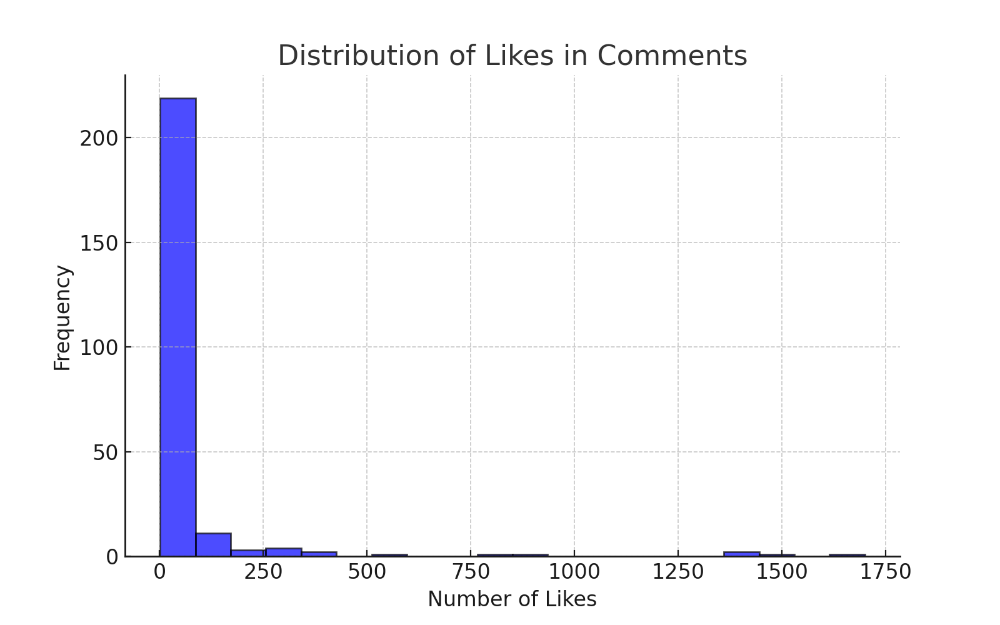
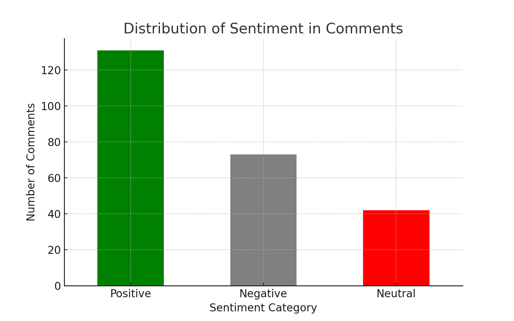
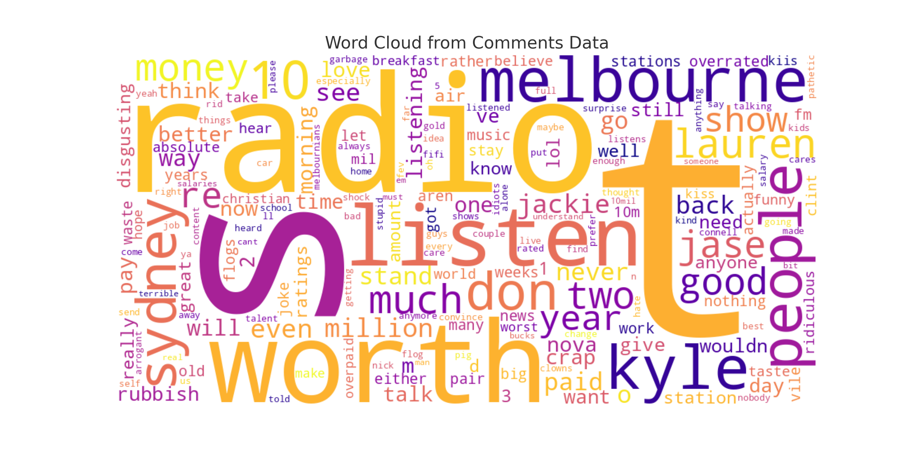
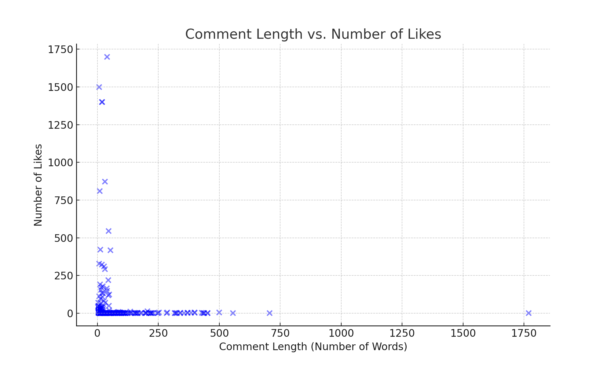

# Sentiment & Engagement Trends in Social Media: A Case Study on Radio Host

## Introduction

Public sentiment plays a crucial role in shaping the reputation of public figures, especially in the media industry. Recently, a Facebook post discussing why **famous radio hosts failed to expand their reach** in another part of the country sparked public debate.

To understand **why this happened and what the public thinks**, we conducted an in-depth sentiment analysis of the comments on this post. However, **not all comments carry the same weight**—some receive hundreds of likes, making them **more influential** in shaping overall sentiment.

This project explores **how weighting sentiment based on likes** can provide a more **accurate** representation of public opinion.

---

## Objectives

- **Perform sentiment analysis** to classify public opinion into positive, neutral, or negative categories.
- **Prioritize high-engagement comments** by giving more weight to comments with higher likes.
- **Identify trending discussion topics** using NLP techniques.
- **Explore correlations** between comment length, sentiment, and engagement.
- **Demonstrate the power of feature weighting** in sentiment analysis.

### Real-World Applications:
- **Brand reputation management** (analyzing customer feedback).
- **Political sentiment analysis** (measuring voter perception).
- **Social media monitoring** (identifying trends and controversies).

---

## Data Overview

The dataset consists of:
- **Comments**: User-generated opinions on the Facebook post.
- **Likes**: The number of likes each comment received (used as a weight for importance).

By analyzing this data, we aim to **understand the public mood and identify dominant narratives**.

---

# Analysis & Insights

## 1. Understanding Engagement: Likes Distribution

We analyzed how **likes were distributed across comments** to understand engagement patterns.

### Key Statistics:
- **Average number of likes per comment**: `57.15`
- **Maximum number of likes received**: `1700`

### Insights:
- Some comments received **very high engagement**, making them key influencers in shaping public perception.
- Many comments had **low engagement**, which could skew sentiment analysis if not properly weighted.

---

## 2. Top & Bottom Comments: What Got the Most Attention?

To understand **which opinions resonated the most**, we extracted the most and least liked comments.

### Top 5 Most Liked Comments

| Comment | Likes |
|---------|-------|
| "Can't believe the world we live in when they get p..." | 1700 |
| "they were beaten by ABC local radio..." | 1500 |
| "One of the most embarrassing things about Australi..." | 1400 |
| "I would need to be paid $10 million a year to list..." | 1400 |
| "I don't understand how people in Sydney like them...." | 873 |

### Bottom 5 Least Liked Comments

| Comment | Likes |
|---------|-------|
| "I cant stand them Jase and Lauren are so much bet..." | 2 |
| "Certainly aren't worth anything like 10 million. K..." | 2 |
| "Well done Loz and Jase your the best for sure They..." | 2 |
| "I don't find the big deal about them Pro because t..." | 2 |
| "I can do the job for $1 0 0 Paying that salary for..." | 2 |

### Insights:
- The most liked comments **strongly criticized the radio hosts**, indicating **negative sentiment dominates engagement**.
- The least liked comments were **neutral or positive**, showing that **critical opinions attract more attention**.

---

## 3. Sentiment Analysis: What’s the Public Mood?

We categorized each comment into **Positive, Neutral, or Negative** sentiment using NLP.

### Insights:
- **Negative sentiment was dominant**, especially among high-liked comments.
- **Neutral and positive comments were significantly lower**, indicating **widespread dissatisfaction**.

---

## 4. What Are People Talking About? Word Frequency & Topics

We extracted key discussion topics using:
1. **A word cloud** to visualize common terms.
2. **Topic modeling (LDA)** to group discussions into themes.

### Topic Modeling (LDA) Results:

| Topic | Top Keywords |
|-------|-------------|
| 1 | looks, joke, aren, jackie, choice, public, let, listen, 10, worth |
| 2 | just, 10, don, people, worth, sydney, kyle, melbourne, listen, radio |
| 3 | melburnians, high, course, triple, ridiculous, victorians, talent, little, big, stand |

### Insights:
- The most common words reflect **strong opinions about radio hosts**.
- The LDA model identified key discussion themes, such as **host salaries, listener dissatisfaction, and station changes**.

---

## 5. Do Longer Comments Get More Likes?

We analyzed whether **comment length affects engagement**.

### Findings:
- **Weak negative correlation (`-0.367`)**, meaning **shorter comments tend to receive more likes**.
- **Longer comments provide more detail but are less engaging** for casual users.

---

## 6. What Drives Engagement? Correlation Analysis

We examined relationships between **sentiment, comment length, and number of likes**.

| Metric | Spearman Correlation |
|--------|----------------------|
| Sentiment Score vs. Likes | `-0.059` |
| Comment Length vs. Likes  | `-0.367` |

### Insights:
- **No strong correlation** between sentiment and likes (both positive and negative comments could receive high engagement).
- **Shorter comments tend to receive more engagement**.

---

# Conclusion: Why This Matters

This analysis **proves the power of weighting user engagement in sentiment analysis**. If we had performed **basic sentiment analysis**, the overall sentiment would have been **misleading**.

### Key Takeaways:
- **Negative sentiment dominates public discourse** and drives engagement.
- **Feature weighting (likes) alters sentiment perception**, revealing more accurate public opinion.
- **Shorter, sharp comments attract more likes**, while long-form comments go unnoticed.

---

## 🚀 Future Work

- Implement **deep learning models** for **advanced sentiment analysis**.
- Compare sentiment trends across **different social media platforms**.
- Analyze **time-based engagement trends** if timestamp data is available.

---

📌 **This project showcases the impact of weighting features in sentiment analysis and its applications in marketing, politics, and customer feedback analysis.** 🚀
